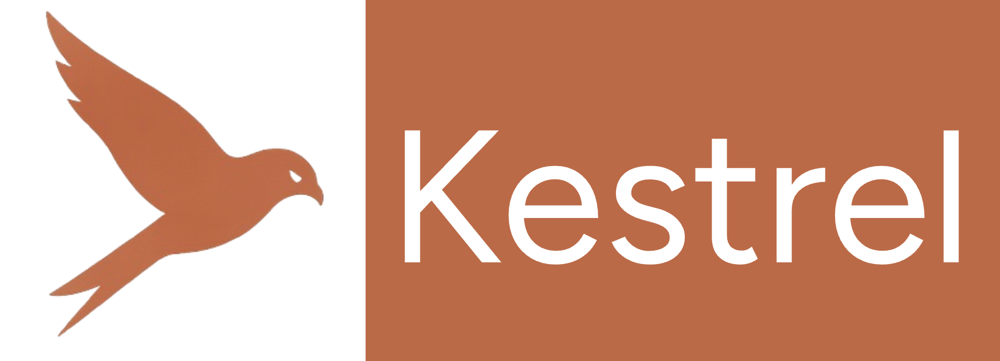
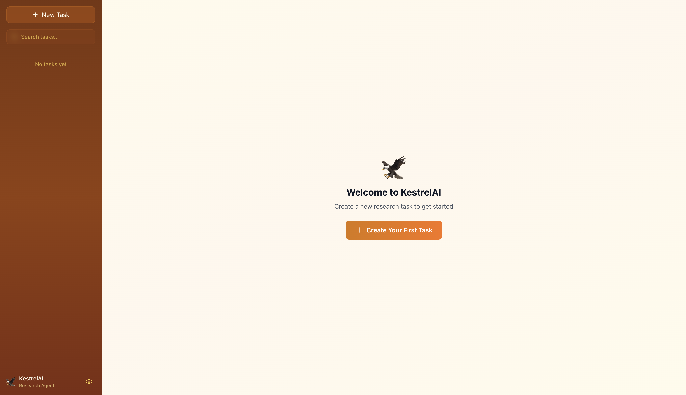
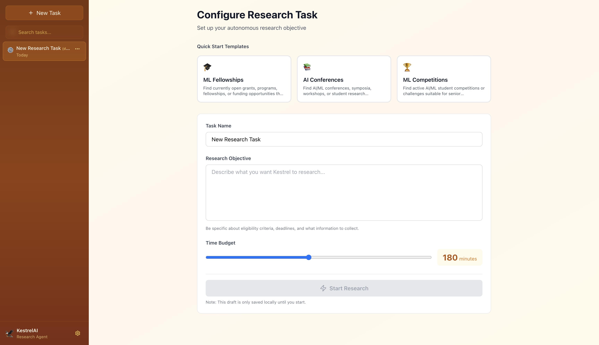
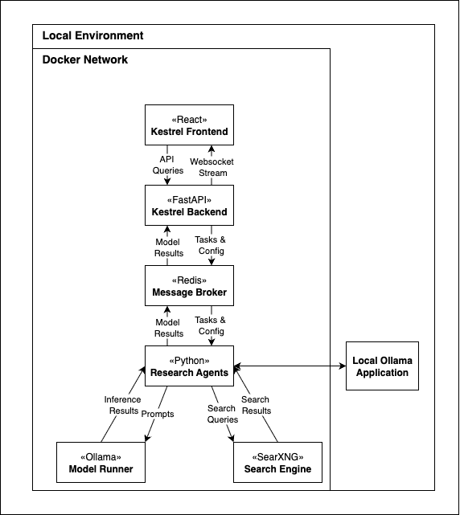

<h1 align="center">
  <a href="https://github.com/dankeg/KestrelAI">
    <!-- Please provide path to your logo here -->
    
  </a>
</h1>

<div align="center">
  Kestrel
  <br />
  <a href="#about"><strong>Explore the screenshots »</strong></a>
  <br />
  <br />
  <a href="https://github.com/dankeg/KestrelAI/issues/new?assignees=&labels=bug&template=01_BUG_REPORT.md&title=bug%3A+">Report a Bug</a>
  ·
  <a href="https://github.com/dankeg/KestrelAI/issues/new?assignees=&labels=enhancement&template=02_FEATURE_REQUEST.md&title=feat%3A+">Request a Feature</a>
  .<a href="https://github.com/dankeg/KestrelAI/discussions">Ask a Question</a>
</div>

<div align="center">
<br />

[](LICENSE) [](https://github.com/dankeg/KestrelAI/issues?q=is%3Aissue+is%3Aopen+label%3A%22help+wanted%22) [](https://github.com/dankeg)


</div>

<details open="open">
<summary>Table of Contents</summary>

- [About](#about)
  - [Built With](#built-with)
  - [Architecture](#architecture)
- [Getting Started](#getting-started)
  - [Prerequisites](#prerequisites)
  - [Installation](#installation)
- [Usage](#usage)
- [Roadmap](#roadmap)
- [Support](#support)
- [Project assistance](#project-assistance)
- [Contributing](#contributing)
- [Authors & contributors](#authors--contributors)
- [License](#license)

</details>

---

## About

**Kestrel** is a local-first research assistant that self-schedules and executes support tasks over long horizons so you can stay focused on key, complex & novel tasks. It handles the mechanical work—searching, filtering, extracting, and organizing evidence in the background, preparing it for review and analysis. 

**Designed for small local models.** Kestrel is built to run with **small LLMs (~1–7B)** via **Ollama**, so it’s **laptop/desktop-friendly** (macOS, Windows, Linux; CPU-only works, GPU optional). No server cluster required.

### What it does
- **Task Exploration:**: Leverages gathered evidence to iterate on tasks, identifying and pursuing new branches and next steps. 
- **Source Provenance**: Uses a deep research approach, but maintains a clear record of consulted searches and how they impact exploration and findings. 
- **Long-running support:** Keep tasks moving in the background and surface **auditable checkpoints** for review and redirection, rather than a single final report. 

> **Example:** Example: As you interpret a frontier paper and plan a novel study, Kestrel runs in the background to resolve the tooling (**Polars vs. pandas vs. Spark**), gathering real-world usage, extracting cited performance claims, and assembling a reviewable comparison.

### How it works (at a glance)
- **Research Agent** — Executes concrete micro-tasks (search → retrieve → filter → extract → narrow summary) and proposes specific follow-ups when evidence warrants it.  
- **Orchestrator** — Plans/schedules work, tracks progress and blockers, pivots when stalled, and emits checkpoints you can accept or adjust. This keeps efforts coherent over hours or days.

### Orchestrator profiles
| Profile        | Scope & behavior                                        | Typical runtime |
|----------------|----------------------------------------------------------|-----------------|
| **Hummingbird**| Quick breadth-first sweeps; targeted lookups.            | Minutes–~2h     |
| **Kestrel**    | Medium-horizon exploration with closely related branches.| Multi-hour      |
| **Albatross**  | Long-horizon, open-ended exploration with reviews.       | Day-scale+      |

(Names are mnemonic. Community-authored profiles with clear behaviors are welcome—e.g., a **Parrot** profile for multi-agent dialogue.)


<details>
<summary>Screenshots</summary>
<br>

<table>
  <tr>
    <td align="center" width="50%">
      <a href="docs/images/home.png">
        
      </a>
      <br><sub>Home page</sub>
    </td>
    <td align="center" width="50%">
      <a href="docs/images/new_task.png">
        
      </a>
      <br><sub>Adding task</sub>
    </td>
  </tr>
</table>


</details>

## Design

### Built With
* Backend: FastAPI
* Frontend: React
* Middleware: Redis
* Model Runner: Ollama

More model engines and integrations are under development!

### Architecture 



### Data Contracts

Redis Queues and Channels:


REST API: 

## Getting Started

### Prerequisites
Ensure the following are installed:
- [Ollama](https://ollama.com/) if not using the Dockerized version 
  - Recommended for Apple Silicon due to [Lack of GPU Passthrough](https://github.com/ollama/ollama/issues/3849)
- [Docker Desktop](https://www.docker.com/products/docker-desktop/)

### Installation

Clone the repository from Github:

```
git clone git@github.com:dankeg/KestrelAI.git
```

Ensure that Docker Desktop is running (easy way to check is running `docker info` in the terminal)

Navigate to the root of the repo, and run the following command to build and launch the application. 

```
docker compose up --build
```

Alternatively, rather than building locally images are built through Github Actions, and can be fetched with `docker pull` first.

After a few minutes, the application will finish building. By default, it launches at `http://localhost:5173/`. Navigate here in a browser, and it's ready to use!

## Usage

Using Kestrel is fairly straightforward. Create a new task, define a description for the research agents to base their exploration off of, and provide a time-box. Some examples are provided of tasks Kestrel can perform. 

From there, the dashboard lets you monitor progress, such as tracking searches & the resulting sources, viewing checkpoints & reports, and exporting results. 

## Roadmap

See the [open issues](https://github.com/dankeg/KestrelAI/issues) for a list of proposed features (and known issues).

- [Top Feature Requests](https://github.com/dankeg/KestrelAI/issues?q=label%3Aenhancement+is%3Aopen+sort%3Areactions-%2B1-desc) (Add your votes using the 👍 reaction)
- [Top Bugs](https://github.com/dankeg/KestrelAI/issues?q=is%3Aissue+is%3Aopen+label%3Abug+sort%3Areactions-%2B1-desc) (Add your votes using the 👍 reaction)
- [Newest Bugs](https://github.com/dankeg/KestrelAI/issues?q=is%3Aopen+is%3Aissue+label%3Abug)

## Support
Reach out to the maintainer at one of the following places:

- [GitHub Discussions](https://github.com/dankeg/KestrelAI/discussions)
- Contact options listed on [this GitHub profile](https://github.com/dankeg)

## Project assistance

If you want to say **thank you** or/and support active development of Kestrel:

- Add a [GitHub Star](https://github.com/dankeg/KestrelAI) to the project.
- Tweet about the Kestrel.
- Write interesting articles about the project on [Dev.to](https://dev.to/), [Medium](https://medium.com/) or your personal blog.

Together, we can make Kestrel **better**!

## Contributing

All contributions are **greatly appreciated**. Kestrel is meant to be a practical, community-focused project, focusing on supporting real-world use-cases. New feature suggestions are welcome, especially new orchestrator profiles tailored towards particular tasks of requirements, such as observability or structure. 

Please read [our contribution guidelines](docs/CONTRIBUTING.md), and thank you for being involved!

## Authors & contributors

The original setup of this repository is by [Ganesh Danke](https://github.com/dankeg).

For a full list of all authors and contributors, see [the contributors page](https://github.com/dankeg/KestrelAI/contributors).


## License

This project is licensed under the **MIT license**.

See [LICENSE](LICENSE) for more information.

