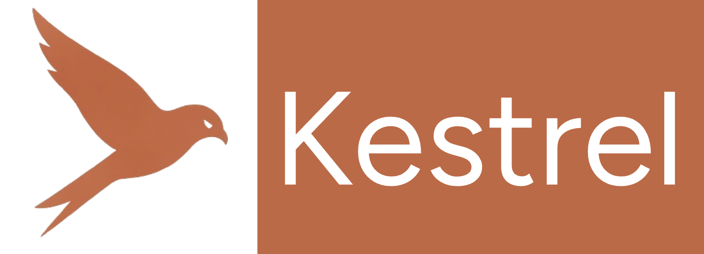
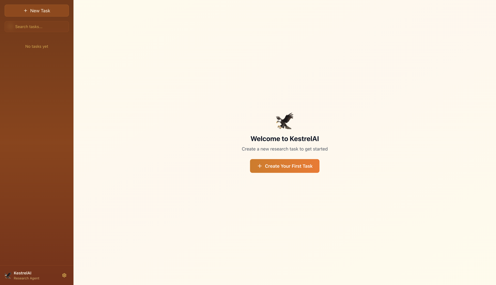
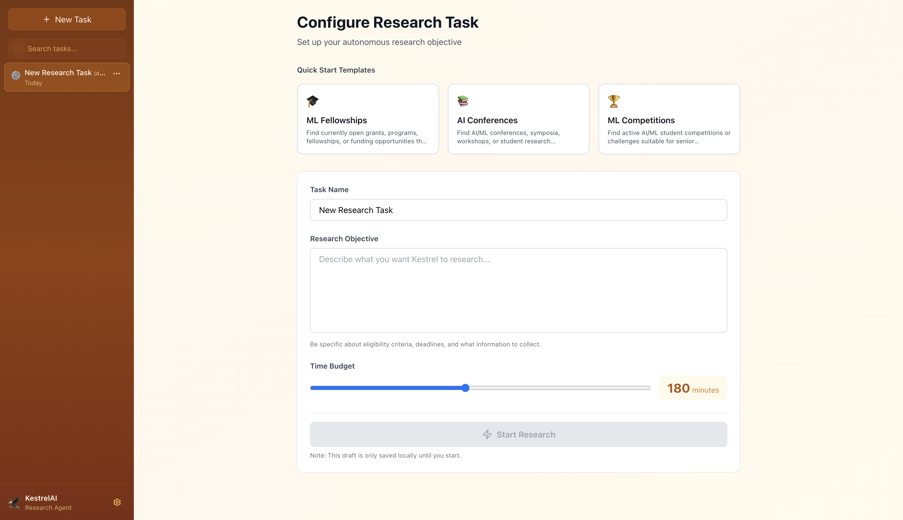

<h1 align="center">
  <a href="https://github.com/dankeg/KestrelAI">
    <!-- Please provide path to your logo here -->
    
  </a>
</h1>

  Kestrel
   
  <a href="#about"><strong>Explore the screenshots »</strong></a>
   
   
  <a href="https://github.com/dankeg/KestrelAI/issues/new?assignees=&labels=bug&template=01_BUG_REPORT.md&title=bug%3A+">Report a Bug</a>
  ·
  <a href="https://github.com/dankeg/KestrelAI/issues/new?assignees=&labels=enhancement&template=02_FEATURE_REQUEST.md&title=feat%3A+">Request a Feature</a>
  .<a href="https://github.com/dankeg/KestrelAI/discussions">Ask a Question</a>

 

  

Table of Contents

- [About](#about)
  - [Built With](#built-with)
- [Getting Started](#getting-started)
  - [Prerequisites](#prerequisites)
  - [Installation](#installation)
- [Usage](#usage)
- [Roadmap](#roadmap)
- [Support](#support)
- [Project assistance](#project-assistance)
- [Contributing](#contributing)
- [Authors & contributors](#authors--contributors)
- [License](#license)

---

## About

<table><tr><td>

> **[?]**
> Provide general information about your project here.
> What problem does it (intend to) solve?
> What is the purpose of your project?
> Why did you undertake it?
> You don't have to answer all the questions -- just the ones relevant to your project.

Screenshots

 

<table>
  <tr>
    <td align="center" width="50%">
      
       Home page
    </td>
    <td align="center" width="50%">
      
       Adding task
    </td>
  </tr>
</table>

</td></tr></table>

### Built With
* Backend: FastAPI
* Frontend: React
* Middleware: Redis
* Model Runner: Ollama

More model engines and integrations are under development!

## Getting Started

### Prerequisites

> **[?]**
> What are the project requirements/dependencies?

### Installation

> **[?]**
> Describe how to install and get started with the project.

## Usage

> **[?]**
> How does one go about using it?
> Provide various use cases and code examples here.

## Roadmap

See the [open issues](https://github.com/dankeg/KestrelAI/issues) for a list of proposed features (and known issues).

- [Top Feature Requests](https://github.com/dankeg/KestrelAI/issues?q=label%3Aenhancement+is%3Aopen+sort%3Areactions-%2B1-desc) (Add your votes using the 👍 reaction)
- [Top Bugs](https://github.com/dankeg/KestrelAI/issues?q=is%3Aissue+is%3Aopen+label%3Abug+sort%3Areactions-%2B1-desc) (Add your votes using the 👍 reaction)
- [Newest Bugs](https://github.com/dankeg/KestrelAI/issues?q=is%3Aopen+is%3Aissue+label%3Abug)

## Support

> **[?]**
> Provide additional ways to contact the project maintainer/maintainers.

Reach out to the maintainer at one of the following places:

- [GitHub Discussions](https://github.com/dankeg/KestrelAI/discussions)
- Contact options listed on [this GitHub profile](https://github.com/dankeg)

## Project assistance

If you want to say **thank you** or/and support active development of Kestrel:

- Add a [GitHub Star](https://github.com/dankeg/KestrelAI) to the project.
- Tweet about the Kestrel.
- Write interesting articles about the project on [Dev.to](https://dev.to/), [Medium](https://medium.com/) or your personal blog.

Together, we can make Kestrel **better**!

## Contributing

First off, thanks for taking the time to contribute! Contributions are what make the open-source community such an amazing place to learn, inspire, and create. Any contributions you make will benefit everybody else and are **greatly appreciated**.

Please read [our contribution guidelines](docs/CONTRIBUTING.md), and thank you for being involved!

## Authors & contributors

The original setup of this repository is by [Ganesh Danke](https://github.com/dankeg).

For a full list of all authors and contributors, see [the contributors page](https://github.com/dankeg/KestrelAI/contributors).

## License

This project is licensed under the **MIT license**.

See [LICENSE](LICENSE) for more information.

